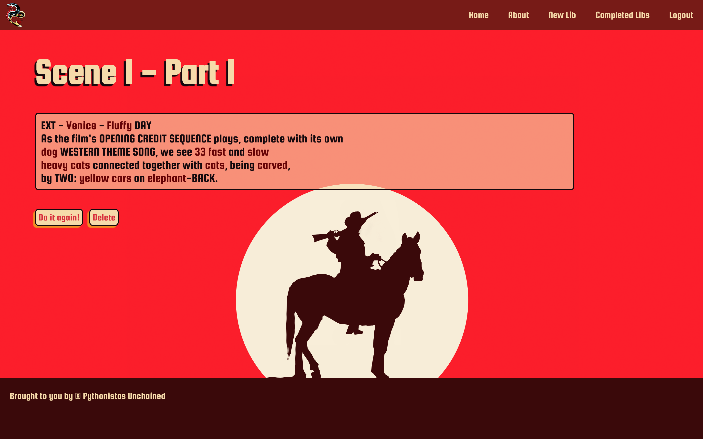
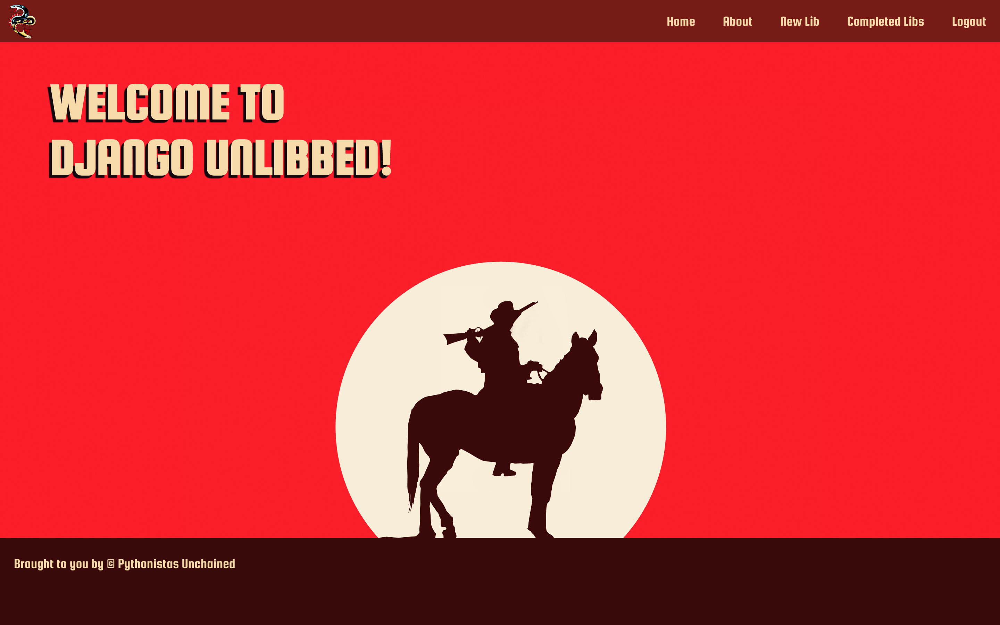

# Django Unlibbed

## Objective

Interactive mad libs based on excerpts from the movie
Django Unchained

## Technology User

- Python
- Django
- PSQL
- Heroku

## User Stories

- AAU I want to login to access to my completed libs
- AAU I want to input my own words in to the Django Unchained movie script
- AAU I want to be able to log in and log out
- AAU I want to click a button to get a new lib
- AAU I want to view my completed libs in script-order
- AAU I want to be able to edit and delete my libs
- AAU I want to see information about the app's developers
- AAU I want a poppin' UI

## Stretch Goals

- Film’s theme song in the background of the application
- Compilation of other people's libs in script order
- Random word generator
- View whole scene in one page after all parts are completed
- Continuity throughout completed libs page by employing global variables

## Wire Frames

Web App:

Models:

## Screenshot(s)

Home Page:

Finished Lib:

## Instructions

Users will start by creating an account by selecting the 'Sign Up' button in the top right of the navigation bar and completing the linked registration form.

New users are routed to the 'New Lib' where they can select a part of the Django Unchained movie script. The 'New Lib' page may also be accessed by clicking the 'New Lib' button in the top right of the navigation bar. Once a part is selected the user may complete a form that consists of a part of speech or description of the type of word that must be input. Once the form is submitted, users may now click the 'Completed Libs' button in the top right of the navigation bar and view their input framed with excerpts from the film's script.

Users may view information about the application's developers in the About page, accessible by the 'About' button in the top right of the navigation bar. Each of the three developers are profiled with their project responsibilities and links to their LinkedIn and GitHub profiles.

## Trello Board

[Trello Board](https://trello.com/b/pGK9J44a/pythonistas-unchained-django-unlibbed)

## Pitch Deck

[Pitch Deck](https://docs.google.com/presentation/d/1uwseGUwtcYWAlPSTb-Kys7gZiOxlntK2aqg0_D6EOhA/edit#slide=id.p)

## Deployed Link

[Heroku Link](https://djangounlibbed.herokuapp.com/)
